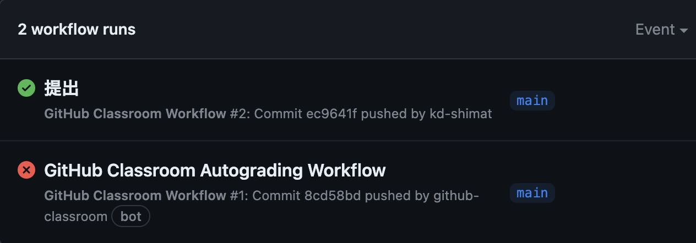

# 課題について

## ファイルの追加(add)とコミット(commit)

1. 課題として提出するファイルをVSCodeで開く<br>
   VSCodeのメニューから「ファイル->フォルダーを開く」を選択し、`C:¥web_app_dev¥03-first-php-...`を選択します。
2. VSCodeサイドバーのGit Graphのアイコン{: style="width: 20px;height: auto;" }をクリック
3. 変更の欄に`hello.php`,`error.php`が表示されていることを確認し、+ボタンクリック<br>

4. 「ステージされている変更」に移動していれば、addはOK
5. メッセージの欄にメッセージを入力し、✔のボタンを押すとcommitもOK

## ファイルのプッシュ(push)

1. 変更の同期ボタンをクリック<br>
   <br>
    ※「変更の同期」ボタンですが、同じローカルリポジトリを繰り返しpushすると、「Branchの発行」という文言に変わることがあります。
    どちらもリモートリポジトリにpushできるので問題はありません。
2. 再度[本章リモートリポジトリ](https://classroom.github.com/a/yRgScATF)にアクセスし、編集内容が反映されていればOK<br>
    {: style="width: 660px;height: auto;" }

```note
## Dev Containersを起動した状態で、add、commit、pushができない場合

Dev Containersを起動した状態で、commitなどしようとした際、`Managed unsafe...`というメッセージが出るだけでうまくできないという学生が散見されます。その場合、以下のいずれかを実施してください。

### ◆ワークスペースの信頼を管理

1. コマンドパレットを開いて(Ctrl-Shift-P MacはCmd-Shift-P)、`workspace trust`と入力 
    
2. 「親ディレクトリを信頼」を押す
   

### ◆Dev Containers一旦停止してpush

1. コマンドパレットを開いて、`dev containers local`と入力
2. 「フォルダーを再度ローカルで開く(Dev Containers: Reopen Folder Locally)」を選択
3. add、commit、pushができる
```

## 採点について

本章以降、提出した課題がGitHub上で自動採点されます。
**pushした課題が合格したかはpush後に必ず確認してください。**

### ◆課題の合格基準について

- `hello.php`をブラウザで開いた時、`Hello,PHP`と表示されること
- PHPの出力命令を用いて出すこと
- **最初の**「pタグ」の要素として出すこと

### ◆合格確認方法

1. pushで課題を提出
   ※既に実施済みです。
2. [本章リモートリポジトリ](https://classroom.github.com/a/yRgScATF)にアクセス<br>
3. 画面上部にある`Actions`をクリック<br>
   {: style="width: 660px;height: auto;" }
4. **一番上**の行のタイトル横に、緑色のチェックが入っていればOK<br>
   {: style="width: 660px;height: auto;" }

```note
## エラーが出た時の対処法

自動採点がエラーになると、タイトルの横に赤いばつ印がでます。
その場合の解決策を以下に示します。

### ◆タイムアウトになっていないかを確認する

タイムアウト自体はGitHubの仕様上防ぎようがありません。
タイムアウトになった場合は、GitHub上で処理を再度処理を実行すると解決できます。

例えば、エラーが出た場合、右端の赤枠で囲まれている箇所に処理時間があります。
ここが4分前後かかっている場合は、まずタイムアウトの可能性を疑ってください。


具体的なタイムアウトの確認・解決方法は、

  1. `Actions`のタイトルが下記のようにリンクになっているので、クリック
      
  2. `Arun-autograding-tests.png`をクリック
      
  3. 赤いばつ印が出ている行をクリックし、開く
      
  4. `Operation timed out after 180000 milliseconds with 0 bytes received`のメッセージがあればタイムアウト
      
  5. 解決策としては、右上に`Re-run jobs`(再実行)のボタンがあるので、`Re-run failed jobs`(失敗した処理だけ再実行)をクリックしてください。
      <br>
      
  6. タイムアウトにならず処理が終了したらOK。また、タイムアウトになった場合は、同じことを繰り返す。※タイムアウトでないエラーは、次の解決策を参照。

### ◆プログラムが正確に書かれているか確認する

プログラムが正確に書かれているかを確認してください。
たとえ、ブラウザの画面でそれっぽく表示されても、正しい構文でなければ自動採点ではエラーとなります。
エラーが出た際は、以下の点を確認してください。

  1. `Hello,PHP`の大文字と小文字が正しく書けているか
  2. `Hello,PHP`の前後、間にスペースが入っていないか
  3.  HTMLのタグが正しく書けているか
    ※特に`Hello,PHP`前後の、**<p>タグ**を確認してください。自動採点では、**<p>タグ**で囲まれた文字列を判定材料としています。
```

## 提出期限

提出期限は、**2025年5月9日(金)**までとします。