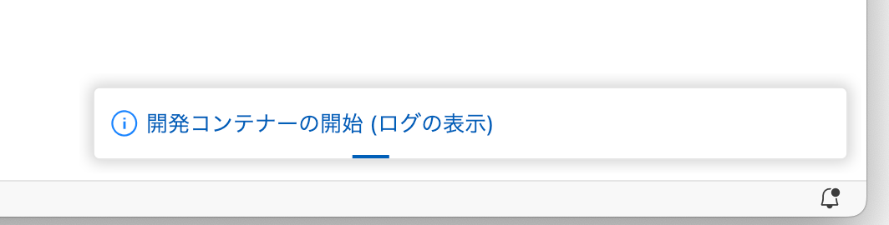

# 開発環境の構築

```warning
Dockerをインストールできていない方は、[こちら](https://classroom.google.com/c/NjYwMjEyMzgyMzQ2/a/NjczMzA3MDU1MTA2/details)の添付資料を参考にインストールをお願いします。
```

PHPが動作する開発環境を構築します。
以下の手順に従ってください。

1. VSCodeのプラグイン「Dev Containers」をインストールする
   VSCode上で`Ctrl-Shift-X`(Macは、`Cmd-Shift-X`)と押し、検索バーに「Dev Containers」と入力し、インストールしてください。
2. VScodeでcloneしたディレクトリ`03-first-php-GitHubのユーザー名`を開く
3. `Ctrl-Shift-P`(Macは、`Cmd-Shift-P`)でVSCodeのコマンドパレットを開く
4. `rebuild`と入力する
5. `Dev Container: Rebuild and Reopen in Container` が出てくるのでクリックする<br>
   
6. **PHP実習環境**をクリックする<br>
   
7. しばらく待つ(CPUパワーとネットワークに依存)<br>
   <br>
    気になる方はログを出すようにすると進行状況がわかります。<br>
    <br>
    ```note
      時間がかかるのは初回の起動時のみです。2回目以降は早いです。
    ```
8. `03-FIRST-PHP-ユーザー名[開発コンテナー...`表示され、`public`などのディレクトリが表示されていればOK<br>
   

```note
**今回のDockerを使った開発環境について説明すると、PHPでの開発がぼやけてしまうので、詳しくは後日まとめて解説します。**

現段階では以下の図のように、Dockerコンテナの中に、LinuxOS、PHP、WebサーバのApacheが搭載された開発環境があるという理解のみで問題ありません。


```
