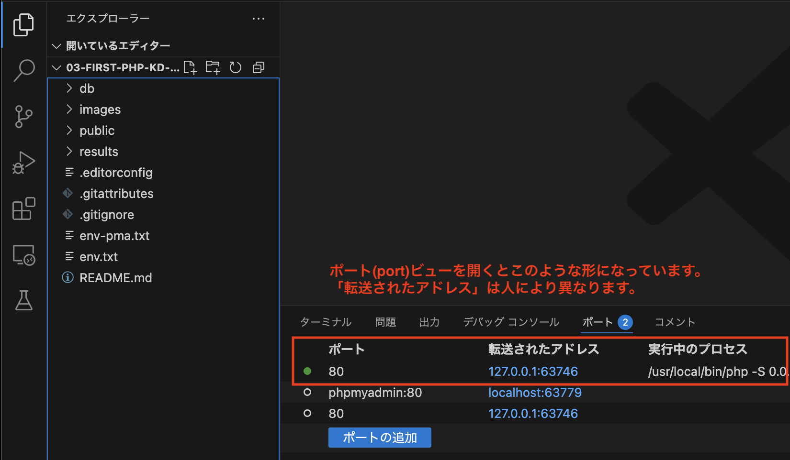

# エラーメッセージ

PHPは、スクリプトの文法上の誤りや、動作上の不具合をブラウザの画面に表示してくれます。
以下の手順でエラーメッセージを確認してください。

1. `public`ディレクトリ内に`error.php`を作成する
   1. 左のバーから`public`を選択し、右クリックで「新しいファイル...」を選択する<br>
        
2. ファイル名を`error.php`と入力し、ファイルを作成する
3. `error.php`に以下コードを記述する

  **error.php**

  ```php

    <!DOCTYPE html>
    <html lang="ja">
    <head>
        <meta charset="UTF-8">
        <meta name="viewport" content="width=device-width, initial-scale=1.0">
        <title>エラーPHP</title> <!-- タイトルを変更する -->
    </head>

    <body>
        <?php
        echo <p>Hello,PHP</p>; // 文字列をシングルクォーテーションで囲まなかった  
        ?>
    </body>
    </html>
  ```
1. 先ほどと同様VSCode下部の**ポート**をクリックする<br>
    

2. マウスカーソルをあてる(ホバーする)と、地球マークが出てくるのでクリックする<br>
    

3. ブラウザが立ち上がり、アドレスバーに`http://localhost:ポート番号`と表示されるので、末尾に`/error.php`を追記してEnter

4. 次のように表示されます。
<br>

このメッセージは、次のように解釈することができます。<br>

   - `Parse error: syntax error, unexpected '<'`<br>
   予期しない `<` による構文エラー<br><br>

   - `in /var/www/error.php on line 11`<br>
   その `<` は`error.php`の11行目に書かれている。<br><br>