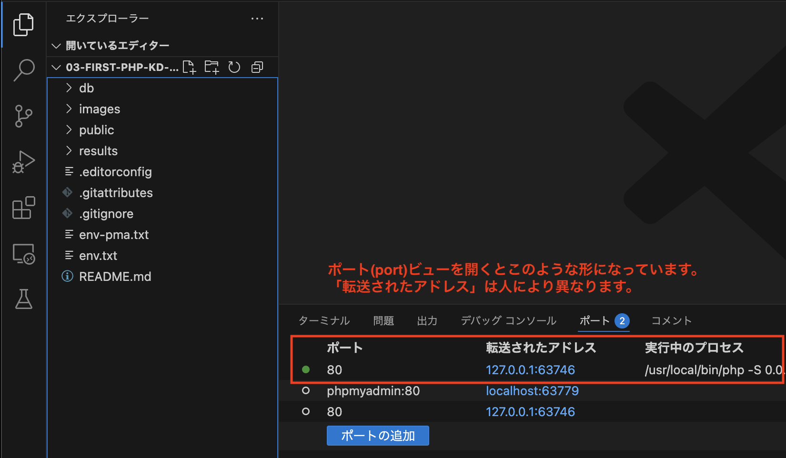
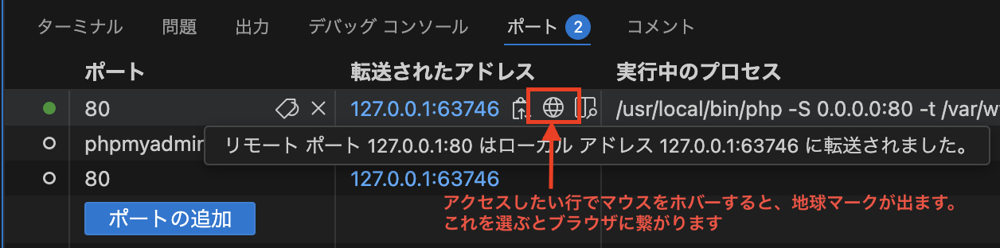
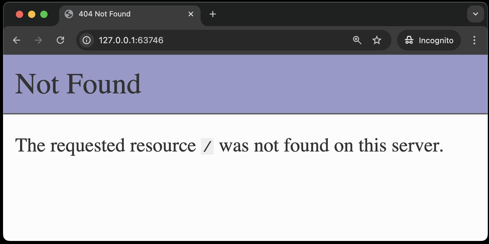
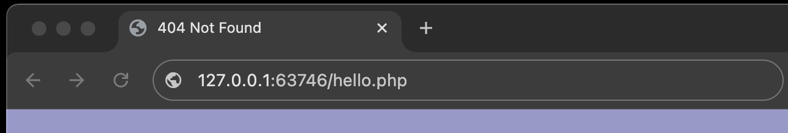
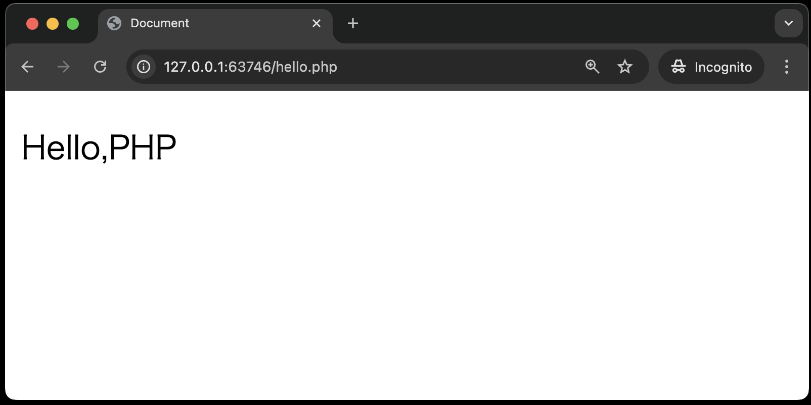

# はじめてのPHP

本章は、次のように画面に表示されるPHPファイルを作成することを目標とします。<br>
<br>

## 今回の課題について

`public` ディレクトリ内の `hello.php` を以下のとおりに編集します。<br>
**`<!-- ① -->` や、`// ⑤` は注釈です。以降の章でも同様にコード内に番号で注釈を記載しますが、入力する必要はありません。**<br><br>

**hello.php**
    ```php
    <!-- 今回は初回なので、仮のファイルを用意しましたが、今後は指示に従い、自分でファイルを作っていって下さい -->
    <!DOCTYPE html> <!-- ① -->
    <html lang="ja"> <!-- ② -->
    <head>
        <meta charset="UTF-8"> <!-- ③ -->
        <meta name="viewport" content="width=device-width, initial-scale=1.0">
        <title>Document</title>
    </head>
    <body>
        <!-- この領域がPHPの処理内容です -->
        <?php // ④
          echo '<p>Hello,PHP</p>'; // ⑤
        ?> <!-- ⑥ -->
        <!-- PHPはここまで -->
    </body>
    </html>
    ```

**【解説】**<br>

①: この文書がHTMLのバージョン5で作成されたものであることを宣言している<br>
②: `lang="ja"` は、この文書が日本語で書かれていることを示している<br>
③: このPHPファイルが`UTF-8`の文字コードで書かれていることを示している<br>
④: ここからPHPスクリプト（プログラムコード）が始まることを示している（`<?php` で始まる）<br>
⑤: 画面に文字列や`<p>`タグなどのHTMLタグを出力するには`echo`コマンドを用い、文字列をシングルクォーテーションで囲む<br>
⑥: PHPスクリプト（プログラムコード）が終わったことを示している（`?>` で終わる）<br><br>

- `hello.php` の中には**HTMLとPHPのコードが混在**する(それがPHP)
- 出力する部分(今回だったら、`Hello,PHP`)については**PHPの命令コード**を記述する<br>
  ※出力する文字を **pタグでくくる** のは、自動採点にて、pタグで囲まれる文字列を判定材料としているためです。自動採点については後述します。

## ページの確認方法

開発環境で操作しているとき、VSCode下部にある**ポート**にて、Webサーバーとの接続先が出るようになっています。



今回は1行しかないので、マウスカーソルをあてる(ホバーする)と、地球マークが出てくるのでクリックしてください。



初期画面は以下のようになります。



URLの末尾に `/hello.php` を追加することで、`hello.php` の内容が表示されます。

1. Ctrl-L(Cmd-L)を押すと大抵のブラウザはアドレス欄を編集できるようになります。
2. アドレスの末尾に `hello.php` を付けてください。 
3. ファイルを作成していれば内容が出てきます。 