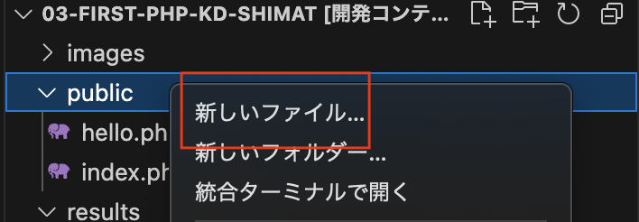
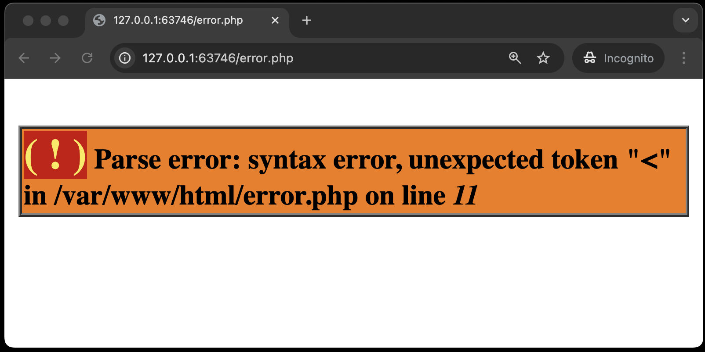
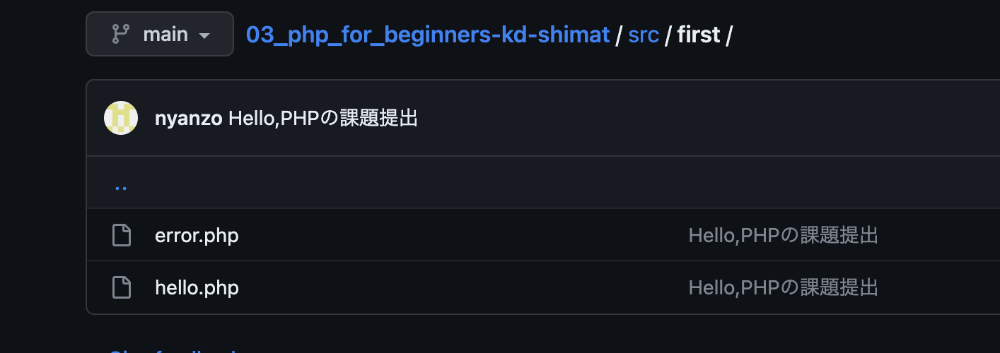
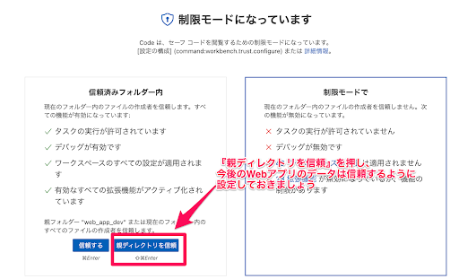
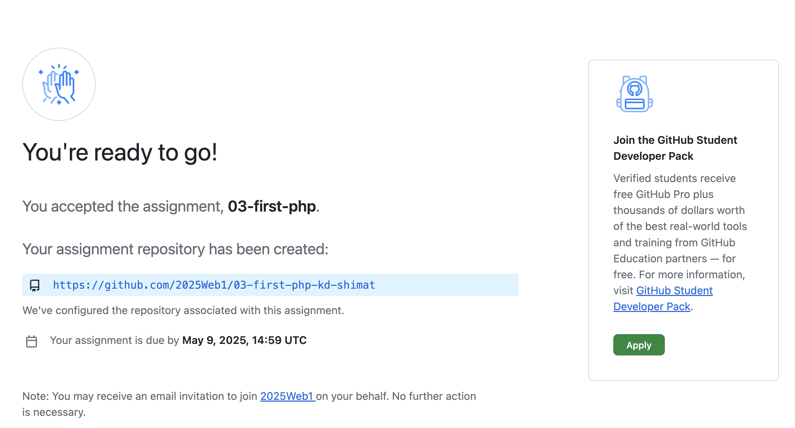
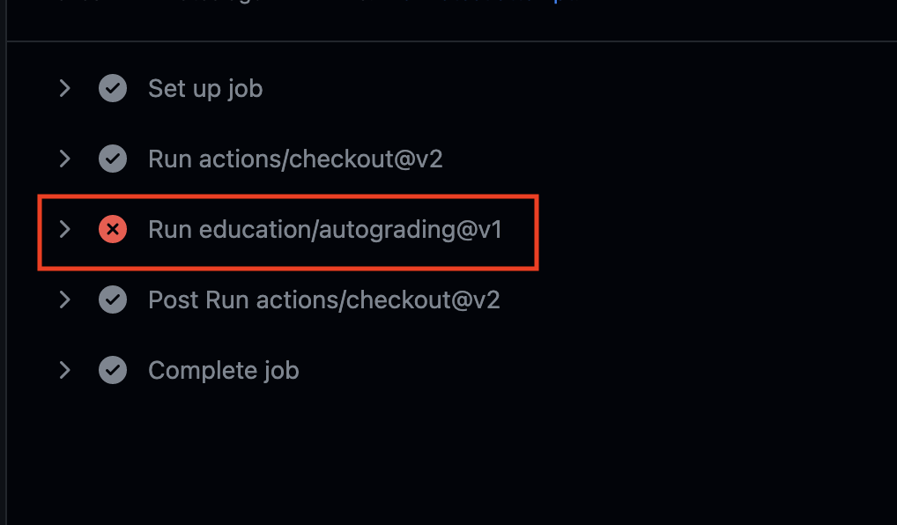

# はじめてのPHP

本章は、次のように画面に表示されるPHPファイルを作成することを目標とします。<br>
<br>

## 今回の課題について

- `public` ディレクトリ内の `hello.php` を以下のとおりに編集します。<br><br>
`hello.php`
    ```php
    <!DOCTYPE html> <!-- ① -->
    <!-- 今回は初回なので、仮のファイルを用意しましたが、今後は指示に従い、自分でファイルを作っていって下さい -->
    <html lang="ja"> <!-- ② -->
    <head>
        <meta charset="UTF-8"> <!-- ③ -->
        <meta name="viewport" content="width=device-width, initial-scale=1.0">
        <title>Document</title>
    </head>
    <body>
        <!-- この領域(bodyタグ内)に処理内容を入れてください -->
        <?php // ④
          echo '<p>Hello,PHP</p>'; // ⑤
        ?>　<!-- ⑥ -->
        <p>0J0X00X神戸電子</p>
        <!-- 今回はここまで -->
    </body>
    </html>
    ```

- `hello.php` の中には**HTMLとPHPのコードが混在**します。(それがPHP)
- 出力させるべき部分(今回だったら、`Hello,PHP`)については**PHPの命令コード**になるようにしてください。
  - 出力されるべき文字は必ず **pタグでくくる** ようにしてください、これができていないとどんなに正しく出力しても検出ができない仕組みになっています。
- **`<!-- ① -->` や、`// ⑤` は注釈です。以降の章でも同様にコード内に番号で注釈を記載しますが、入力する必要はありません。**

①: この文書がHTMLのバージョン5で作成されたものであることを宣言している<br>
②: `lang="ja"` は、この文書が日本語で書かれていることを示している<br>
③: このPHPファイルが`UTF-8`の文字コードで書かれていることを示している<br>
④: ここからPHPスクリプト（プログラムコード）が始まることを示している（`<?php` で始まる）<br>
⑤: 画面に文字列や`<p>`タグなどのHTMLタグを出力するには`echo`コマンドを用い、文字列をシングルクォーテーションで囲む<br>
⑥: PHPスクリプト（プログラムコード）が終わったことを示している（`?>` で終わる）<br><br>

## ページの確認方法

開発環境で操作しているとき、VSCode下部にある**ポート**にて、Webサーバーとの接続先が出るようになっています。


今回は1行しかないので、マウスカーソルをあてる(ホバーする)と、地球マークが出てくるので選んでください。


これでブラウザに渡されて結果の確認ができます。


今回の課題は `hello.php` なので、表示中のページのリンクに `hello.php` を追加してみてください。

1. Ctrl-L(Cmd-L)を押すと大抵のブラウザはアドレス欄を編集できるようになります。
2. アドレスの末尾に `hello.php` を付けてください。 
3. ファイルを作成していれば内容が出てきます。 

## エラーメッセージ

PHPは、スクリプトの文法上の誤りや、動作上の不具合をブラウザの画面に表示してくれます。

1. `public`ディレクトリ内に`error.php`を作成します。左のバーから`public`を選択し、右クリックで「新しいファイル...」を選択してください。 
2. ファイル名を`error.php`と入力するとファイルが作成できます。
3. `error.php`に下記コードを書いてください。<br>

  `error.php`

  ```php

    <!DOCTYPE html>

    <html lang="ja">

    <head>
        <meta charset="UTF-8">
        <meta name="viewport" content="width=device-width, initial-scale=1.0">
        <title>エラーPHP</title> <!-- タイトルも変更する -->
    </head>

    <body>
        <?php
        echo <p>Hello,PHP</p>; // 文字列をシングルクォーテーションで囲まなかった  
        ?>
        <p>0J0X0XX神戸電子</p>
    </body>

    </html>
  ```
1. 先ほどと同様VSCode下部の**ポート**をクリックしてください。


2. マウスカーソルをあてる(ホバーする)と、地球マークが出てくるので選んでください。


3. ブラウザが立ち上がり、アドレスバーに`http://localhost:ポート番号`と表示されるので、末尾に`/error.php`を追記してエンターを押してください。

4. 次のように表示されます。
<br>

このメッセージは、次のように解釈することができます。<br>

   - `Parse error: syntax error, unexpected '<'`<br>
   予期しない `<` による構文エラー<br><br>

   - `in /var/www/error.php on line 12`<br>
   その `<` は`error.php`の12行目に書かれている。<br><br>

## 課題の作成と提出

### テキストファイルの追加(add)とコミット(commit)

1. 課題として提出するファイルをVSCodeで開きます。VSCodeのメニューから「ファイル->フォルダーを開く」を選択し、<br>`C:¥web_app_dev¥03-first-php-GitHubのユーザー名`を選択してください。
2. VSCodeサイドバーのGit Graphのアイコンを押す。
3. 変更の欄に`hello.php`,`error.php`が表示されていることを確認し、+ボタンを押す。<br>

1. 「ステージされている変更」に移動していれば、addは成功。
2. メッセージの欄にメッセージを入力し、✔のボタンを押すとcommitは完了。<br><br>

### テキストファイルをプッシュ(push)する

あとは課題を提出するのみ。

1. 変更の同期ボタンを押す。<br><br>
※ちなみにこの「変更の同期ボタン」は、「Branchの発行」という文言に変わることもあるが、どちらもリポートリポジトリにpushできるので問題ありません。

1. ブラウザで、再度課題のリンクにアクセスすると(cloneで使ったURLでも良い)、編集内容が反映されているのがわかる。<br>


### (※追記)Dev Containersを起動した状態で、add、commit、pushができない場合

Dev Containersを起動した状態で、commitなどしようとした際、`Managed unsafe...`というメッセージが出るだけでうまくできないという学生が散見されます。その場合、下記のいずれかを実施してください。

#### ワークスペースの信頼を管理

1. コマンドパレットを開いて(Ctrl-Shift-P MacはCmd-Shift-P)、`workspace trust`と入力 
2. 「親ディレクトリを信頼」を押す
   

#### (追記)Dev Containers一旦停止してpush

1. コマンドパレットを開いて、`dev containers local`と入力
2. 「フォルダーを再度ローカルで開く(Dev Containers: Reopen Folder Locally)」を選択
3. すると普通にadd、commit、pushができるようになります

## 採点について(今回の課題から)

今回から、提出した課題がGitHub上で自動採点されます。pushした課題が合格したかはpush後に必ず確認してください。

### 課題の合格基準について

- `hello.php`をブラウザで開いた時、`Hello,PHP`と表示されること
- PHPの出力命令を用いて出すこと
- **最初の**「pタグ」の要素として出すこと

### 合格確認方法

1. 課題を提出してください。※既に実施済み
1. 下記青色背景のリンクからリモートリポジトリにアクセスしてください。※もしこのページを閉じている方は、[今回の課題ページ](https://classroom.github.com/a/S1hjL1LX)からアクセスすることができます<br>
   
2. 画面上部にある`Actions`をクリックしてください。<br>
   
3. **一番上**の行のタイトル横に、緑色のチェックが入っていればOK。<br>
   

### エラーが出た時の対処法

自動採点がエラーになると、タイトルの横に赤いばつ印がでます。その場合の解決策を下記に示します。

#### タイムアウトになっていないかを確認する

※タイムアウト自体はGitHubの仕様上防ぎようがありませんので、あらかじめご了承ください。タイムアウトになっている場合は、GitHub上で処理を再開すると解決できます。<br>
例えば、エラーが出た場合、右端の赤枠で囲まれている箇所に処理時間があります。ここが4分前後かかっている場合は、まずタイムアウトの可能性を疑ってください。


具体的なタイムアウトの確認・解決方法は、

  1. `Actions`のタイトルが下記のようにリンクになっているので、クリック
      
  2. `Arun-autograding-tests.png`をクリック
      
  3. 赤いばつ印が出ている行をクリックし、開く
      
  4. `Operation timed out after 180000 milliseconds with 0 bytes received`のメッセージがあればタイムアウト
      
  5. 解決策としては、右上に`Re-run jobs`(再実行)のボタンがあるので、`Re-run failed jobs`(失敗した処理だけ再実行)をクリックしてください。
      <br>
      
  6. タイムアウトにならず処理が終了したらOK。また、タイムアウトになった場合は、同じことを繰り返す。※タイムアウトでないエラーは、次の解決策を参照。

### プログラムが正確に書かれているか確認する

プログラムが正確に書かれているかを確認してください。たとえ、ブラウザの画面でそれっぽく表示されても、自動採点ですので融通は聞きません。エラーが出た際は、以下の点を確認してください。

- `Hello,PHP`の大文字と小文字が正しく書けているか
- `Hello,PHP`の前後、間にスペースが入っていないか
- HTMLタグ(`<>`で囲まれているもの)が正しく書けているか
  
  - `Hello,PHP`前後の、`<p>`タグ大事です。HTMLでブラウザにテキスト(文字情報)を表示するときは、`<p>`タグなど、何らかのタグで括られているのが一般的です。タグの記述をおろそかにしないようにしましょう。

## (追記)Dev Containersの停止方法

1. コマンドパレットを開いて、`dev containers local`と入力
2. 「フォルダーを再度ローカルで開く(Dev Containers: Reopen Folder Locally)」
